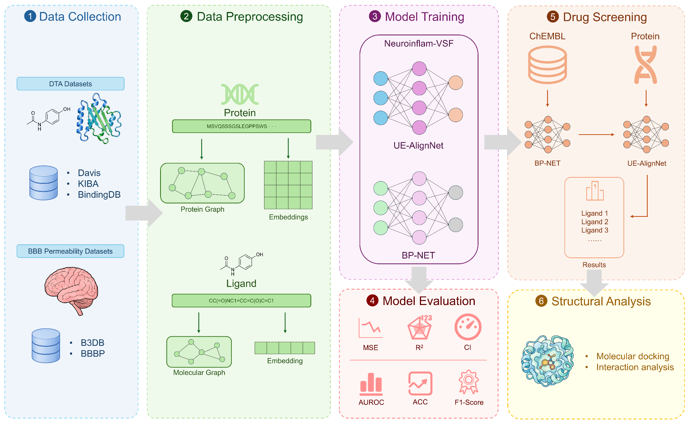
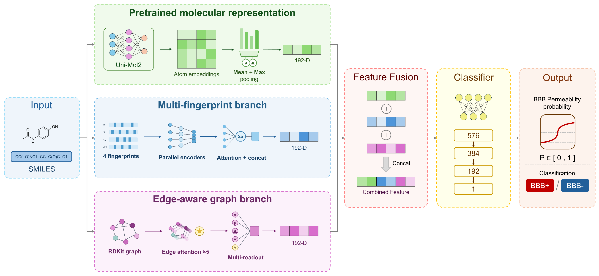

# Neuroinflam-VSF

**A Virtual Screening Framework for Dual Prediction of Drug-Target Affinity and Blood-Brain Barrier Permeability Against Neuroinflammation**

Neuroinflam-VSF prioritizes compounds that combine predicted drug-target affinity (DTA) with predicted blood-brain barrier (BBB) permeability. It integrates two models:

- **UE-AlignNet**, a DTA regression model that combines pretrained molecular and protein representations, molecular and protein graphs, drug-conditioned residue selection, and sparse bidirectional cross-attention.
- **BP-NET**, a BBB-permeability classifier that combines Uni-Mol2 atom representations, multiple molecular fingerprints, and an edge-aware molecular graph branch.

The repository contains the preprocessing, splitting, feature-generation, training, NLRP3-screening, candidate-docking, and NP3-253-redocking code used in the study. It also contains the four redistributable source datasets and the five-dataset split CSVs. The processed BindingDB database is hosted separately on Hugging Face because of its size.

## Study workflow



**Figure 1. Overview of the study workflow.** The study comprises data collection and preprocessing, model training and evaluation, compound screening, and structural analysis.

## Model architectures

### UE-AlignNet


**Figure 2. Architecture of UE-AlignNet.** Protein representations integrate ESM-C residue embeddings with an ESM2-derived residue-contact graph. Compound representations fuse a Uni-Mol2 global embedding with RDKit-derived molecular graph features. Drug-conditioned residue selection, sparse bidirectional cross-attention, and multiscale feature aggregation are then used to predict pKd for Davis and BindingDB or the KIBA score for KIBA.

### BP-NET



**Figure 3. Architecture of BP-NET.** The model uses pooled Uni-Mol2 atom embeddings, attention-fused molecular fingerprints, and an edge-aware RDKit molecular graph encoder. Their representations are fused to predict BBB-permeability probability and class.

## Repository structure

```text
.
├── codes/
│   ├── assets/figures/
│   ├── preprocessing/
│   │   ├── data_preprocessing.py
│   │   ├── data_splitting.py
│   │   └── embedding_generation.py
│   ├── training/
│   │   ├── train_ue_alignnet.py
│   │   └── train_bp_net.py
│   ├── screening/
│   │   └── screen_nlrp3.py
│   └── docking/
│       ├── dock_nlrp3_candidates.py
│       └── redock_np3_253.py
├── data/
│   ├── datasets/             # Source data, split CSVs, and screening outputs
│   ├── embedding/            # Generated molecular/protein features
│   └── docking_results/      # Generated docking/redocking outputs
├── README.md
└── requirements.txt
```

Run commands from the repository root. Training creates `models/` automatically; checkpoints and metrics are generated artifacts and are not tracked by Git.

## Data availability and placement

| Dataset | Public location | File used by the workflow |
|---|---|---|
| B3DB | Included in this repository | `data/datasets/B3DB/B3DB_classification.tsv` |
| BBBP | Included in this repository | `data/datasets/BBBP/BBBP.csv` |
| Davis | Included in this repository | `data/datasets/Davis/{ligands_can.txt,proteins.txt,Y}` |
| KIBA | Included in this repository | `data/datasets/KIBA/{ligands_can.txt,proteins.txt,Y}` |
| BindingDB | [Hugging Face dataset](https://huggingface.co/datasets/lxmgqq/Neuroinflam-VSF) | `data/datasets/BindingDB/bindingdb_preprocessed.db` |

Download the processed BindingDB database before running feature generation or recreating the splits:

```bash
curl -L "https://huggingface.co/datasets/lxmgqq/Neuroinflam-VSF/resolve/main/bindingdb_preprocessed.db?download=true" \
  -o data/datasets/BindingDB/bindingdb_preprocessed.db
```

The expected SHA-256 checksum is:

```text
f24bded965c60d9bda445b5f3ff69b531699ebb279c92bd92defc3a12f0afe60
```

The repository includes train/validation/test CSVs for seeds 1-5. B3DB and BBBP use the `scaffold` scenario; Davis, KIBA, and BindingDB include `warm`, `cold_drug`, `cold_target`, and `double_cold` scenarios.

To rebuild BindingDB preprocessing itself, obtain the source SDF separately from [BindingDB](https://www.bindingdb.org/rwd/bind/chemsearch/marvin/SDFdownload.jsp?all_download=yes), name it `BindingDB_All_2D.sdf`, place it in `data/datasets/BindingDB/`, and record the release date and checksum. The source SDF is not included in either public repository.

### NLRP3 reference sequence

The BindingDB split and NLRP3-screening stages use canonical human NLRP3, UniProt accession [`Q96P20`](https://www.uniprot.org/uniprotkb/Q96P20/entry). If `data/datasets/BindingDB/NLRP3_Q96P20.fasta` is absent, the relevant script downloads it from the [UniProt REST API](https://rest.uniprot.org/uniprotkb/Q96P20.fasta) and validates its accession and 1,036-amino-acid length. In screening, `--offline` disables network access.

## Installation

The manuscript experiments were conducted on Ubuntu 20.04 with Python 3.12.12, PyTorch 2.9.1, CUDA 12.8, cuDNN 9.10.2, RDKit 2023.9.6, unimol-tools 0.1.5, ESM 3.2.4a1, Transformers 5.3.0, NumPy 1.26.4, pandas 2.1.4, and scikit-learn 1.2.2. GPU-specific packages should match the CUDA installation on the target system.

```bash
python -m pip install -r requirements.txt
```

The docking scripts additionally require AutoDock Vina, Open Babel, Meeko, Gemmi, and AutoDockTools/MGLTools. PyMOL is optional and is used only when rendering is requested. One possible installation layout is:

```bash
python -m pip install gemmi meeko
conda install -c conda-forge openbabel
conda create -n mgltools -c bioconda mgltools=1.5.7
```

Install the AutoDock Vina command-line executable from the [official releases](https://github.com/ccsb-scripps/AutoDock-Vina/releases) and ensure that `vina` is available on `PATH`.

The feature generator downloads Uni-Mol2, ESM-C, and ESM2 resources when they are not already cached. Use `--offline` to require cached resources only. The default ESM2 backend is Hugging Face Transformers; `--esm2-backend fair_esm` selects the optional Meta `fair-esm` backend.

## End-to-end workflow

### 1. Preprocess the four repository-hosted datasets

BindingDB is skipped here because the public Hugging Face file is already preprocessed.

```bash
python ./codes/preprocessing/data_preprocessing.py \
  --datasets B3DB BBBP Davis KIBA
```

This creates:

```text
data/datasets/B3DB/b3db_preprocessed.csv
data/datasets/BBBP/bbbp_preprocessed.csv
data/datasets/{Davis,KIBA}/{ligands,proteins,interactions}_preprocessed.csv
data/datasets/preprocessing_report.json
```

BindingDB preprocessing is needed only when starting from the source SDF:

```bash
python ./codes/preprocessing/data_preprocessing.py --datasets BindingDB
```

### 2. Create dataset splits

The repository already contains split CSV files for all five datasets, and all of them can be used directly by the current feature-generation code. To generate the split files, run:

```bash
python ./codes/preprocessing/data_splitting.py --overwrite
```

Split files follow these layouts:

```text
data/datasets/{B3DB,BBBP}/splits/seed_<seed>/scaffold/{train,val,test}.csv
data/datasets/{Davis,KIBA,BindingDB}/splits/seed_<seed>/<scenario>/{train,val,test}.csv
```

### 3. Generate model features

Generate all required ligand and protein artifacts:

```bash
python ./codes/preprocessing/embedding_generation.py
```

Outputs are stored under `data/embedding/<dataset>/`. Each feature directory contains per-entity files and a `manifest.csv`; both training scripts consume these manifests directly.

### 4. Train BP-NET

```bash
python ./codes/training/train_bp_net.py \
  --datasets B3DB BBBP \
  --seeds 1-5 \
  --model-root ./models/BP-NET \
  --run-name default
```

Outputs are written to `models/BP-NET/<dataset>/default/`.

### 5. Train UE-AlignNet

```bash
python ./codes/training/train_ue_alignnet.py \
  --dataset all \
  --seeds 1-5 \
  --target_scenarios warm,cold_drug,cold_target,double_cold \
  --model_base ./models/UE-AlignNet \
  --model_name default \
  --deterministic
```

Outputs are written to `models/UE-AlignNet/<dataset>/default/`.

### 6. Screen ChEMBL compounds against NLRP3

After training the B3DB BP-NET ensemble and BindingDB cold-target UE-AlignNet ensemble:

```bash
python ./codes/screening/screen_nlrp3.py
```

The default workflow downloads approved ChEMBL small molecules (`max_phase = 4`), standardizes and deduplicates parent structures, applies BP-NET with validation-calibrated BBB thresholds, predicts NLRP3 affinity with UE-AlignNet, and writes:

```text
data/datasets/virtual_screening/ChEMBL/BP-NET/
data/datasets/virtual_screening/results/NLRP3_UE-AlignNet/
├── all_predictions.csv
├── top_candidates.csv
├── high_confidence_strong_binders.csv
└── run_manifest.json
```

### 7. Dock the three reported NLRP3 candidates

```bash
python ./codes/docking/dock_nlrp3_candidates.py
```

This manuscript-specific script docks nicergoline, nalfurafine, and revumenib against NLRP3 structure 9GU4 and writes all intermediate and final files below `data/docking_results/NLRP3_candidates/`.

### 8. Validate the docking protocol by redocking NP3-253

```bash
python ./codes/docking/redock_np3_253.py
```

The redocking script automatically reads the receptor PDBQT and Vina configuration generated by the candidate-docking script, retrieves the 9GU4 co-crystal ligand, and writes pose scores and symmetry-corrected heavy-atom RMSD results to `data/docking_results/redocking/9GU4_NP3_253/`. Use `--render-pymol` to render the generated overlay when PyMOL is available.

## Input/output contracts

| Stage | Required input | Principal output | Downstream consumer |
|---|---|---|---|
| Preprocessing | Four included raw datasets; optional BindingDB source SDF | Cleaned CSVs or BindingDB SQLite database | Splitting and DTA feature generation |
| Splitting | Cleaned dataset files and CD-HIT for DTA datasets | Seed/scenario split CSVs | Feature generation and training |
| Feature generation | Classification split SMILES; DTA split IDs plus cleaned entity lookups | Per-entity artifacts and `manifest.csv` | BP-NET and UE-AlignNet training |
| BP-NET training | Scaffold split CSVs and B3DB/BBBP feature manifests | `best_model.pt`, metrics, and predictions | BBB screening |
| UE-AlignNet training | DTA split CSVs and feature manifests | `best.pt`, metrics, and predictions | NLRP3 affinity screening |
| NLRP3 screening | ChEMBL records, model checkpoints, training manifests, and NLRP3 FASTA | Ranked candidate CSVs and run manifest | Candidate selection |
| Candidate docking | Built-in three-compound list plus downloaded/local 9GU4 structure | Prepared receptor, docked poses, scores, and Vina config | Redocking and structural analysis |
| NP3-253 redocking | Candidate-docking receptor and Vina config | RMSD/score tables and overlay files | Protocol validation |

## Reproducibility and generated artifacts

- Dataset and model seeds default to 1-5.
- Split manifests record clustering settings, seeds, input hashes, and split statistics when splits are regenerated.
- Feature manifests record source hashes and generation configurations.
- Training checkpoints include task signatures and support interrupted-run resumption.
- Screening features and prediction chunks are validated and reused.
- Generated `models/`, embeddings, ChEMBL tables, screening results, and docking outputs are ignored by Git and should be archived separately with reported experiments.

The GitHub repository distributes B3DB, BBBP, Davis, and KIBA source files and the checked-in split CSVs. The Hugging Face dataset distributes the processed BindingDB SQLite database.

## License

The source code in `codes/` is licensed under the [MIT License](LICENSE), Copyright (c) 2026 Xumeng Liu.

The MIT License does not apply to benchmark datasets, pretrained models, trained model weights, ChEMBL or UniProt content, or other third-party resources. These materials remain subject to their respective licenses and terms. The manuscript figures in `codes/assets/figures/` are not licensed for reuse under the MIT License unless explicitly stated otherwise.

## Citation

If this repository contributes to your work, please cite the manuscript:

> **Neuroinflam-VSF: A Virtual Screening Framework for Dual Prediction of Drug-Target Affinity and Blood-Brain Barrier Permeability Against Neuroinflammation**

Full bibliographic information will be added upon publication.
